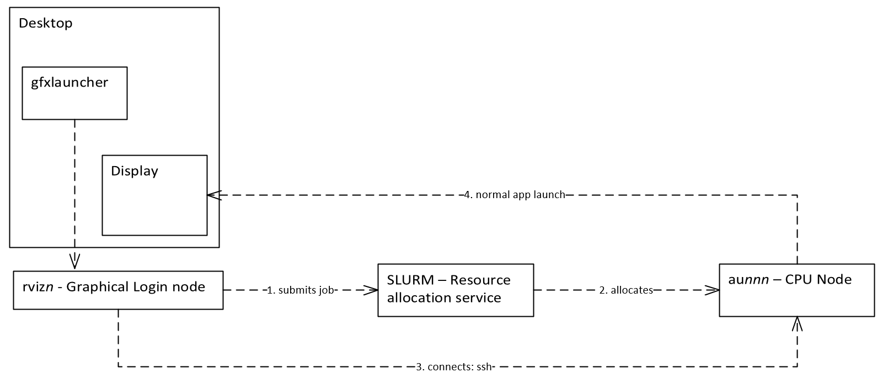
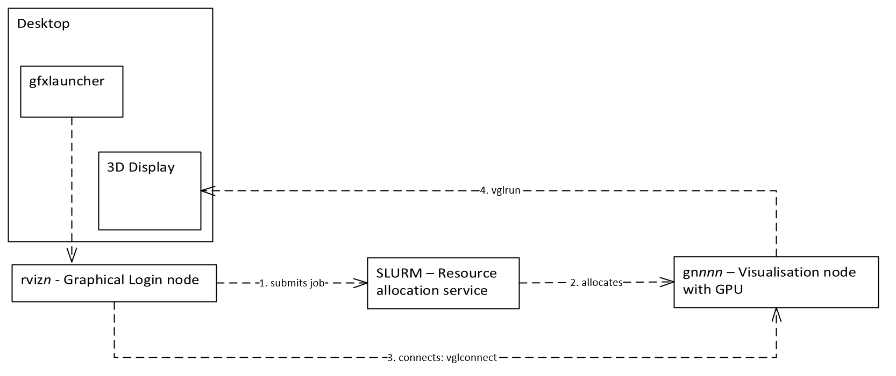
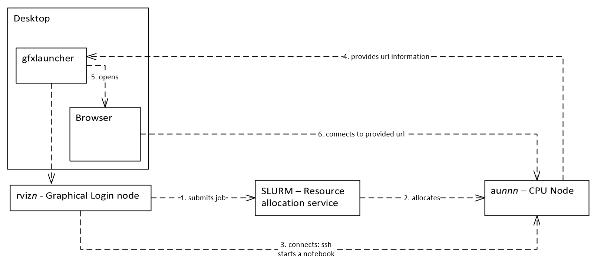
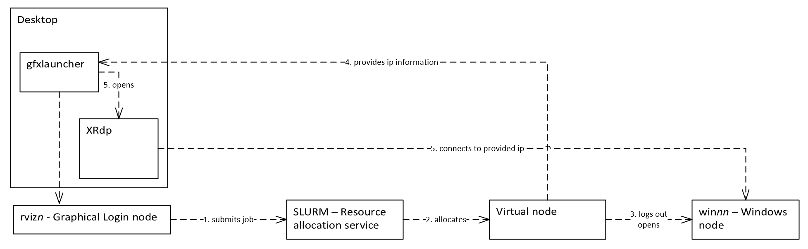

Technical overview
==================

GfxLauncher is implemented as a command-line tool that takes care of launching graphical or interactive jobs in SLURM. The tool provides numerous switches for customizing the user interface for specific details of the application being launched. An example of how the tool, gfxlaunch, is used is shown below:

.. code-block:: bash

    gfxlaunch --vgl --title "Paraview-5.4.1" --partition lvis --account lvis-test --exclusive --tasks-per-node=-1 --cmd /sw/pkg/rviz/sbin/run/run_paraview-5.4.1_rviz-server.sh --simplified

Application launch methods
==========================

The main idea with GfxLauncher is to be able to launch interactive applications, both graphical and web-based, through SLURM. 

GfxLauncher supports 4 different ways of launching applications through SLURM:

1. Running a placeholder job on a node. Starting application by executing SSH to the allocated node.
2. Running a placeholder job on a node. Starting application by executing vglconnect (VirtualGL) to the allocated node.
3. Running a job for starting up a web server for an interactive Notebook session. (Jupyter Notebook or Jupyter Lab).
4. Submitting a job for connecting to windows sessions using Xrdp.

SSH based application launching
-------------------------------

To launch X11-based applications securely through SLURM requires them to be launched through SSH with options for X11 tunneling enabled. This is often not directly available through SLURM based launch methods. GfxLauncher uses a placeholder job to allocate the node. This launch method requires SSH access to the nodes. The following figure illustrates the launch process:

To be able to run the application with the same resource limits as the jobs requires the nodes to have a special pam module (pam_exec) and a special associated script installed for attaching the started process to the context of the place holder job. 

VGLConnect based application launching
--------------------------------------

Launching VirtualGL applications through SLRUM has the same requirements as launching through SSH. In addition, the front-end and nodes must have working VirtualGL installations. GfxLauncher uses vglconnect instead of SSH to connect to the allocated node. The following figure below illustrates the launch process:

Notebook job launching
----------------------

Starting a job running a Jupyter Notebook or JypterLab session is very similar to conventional job submission. A job is submitted to SLURM that starts up the notebook web server. GfxLauncher then waits for the job to start and monitors the job output for the URL to the started Jupyter web server. It then starts a browser session to this URL. If the user by mistake closes the browser window there is a special button in the user interface for reconnecting to the running Jupyter server. The figure below describes this process:

Connecting to Windows sessions using RDP
----------------------------------------

The final launch method is used to connect to specially configured Windows hosts. This launch method also uses a special placeholder job submitted to a specially configured virtual SLURM node. The virtual node is configured with special SLURM epilogue and prologue scripts, that log out current users of the Windows session at job start and automatically log out a user when the walltime has expired. The backend scripts also handle the brokering of backend Windows servers. When a server is allocated, a special file is written in the user directory with the IP number of the backend Windows server. GfxLauncher monitors this file, and when available, launches a remote desktop (RDP) session to the started Windows instance. See the following figure for more details:

